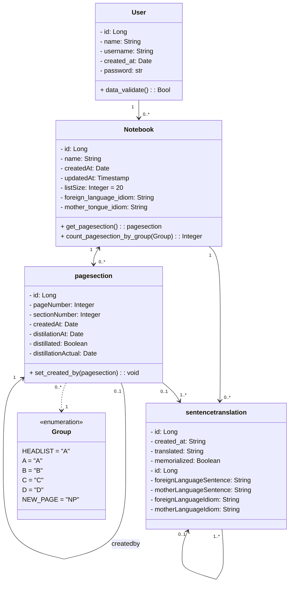

```mermaid
    classDiagram
        class User{
            - id: Long
            - name: String
            - username: String
            - created_at: Date
            - password: str
            
            + data_validate(): Bool
        }

        class Notebook {
            - id: Long
            - name: String
            - createdAt: Date
            - updatedAt: Timestamp
            - listSize: Integer = 20
            - foreign_language_idiom: String
            - mother_tongue_idiom: String

            + get_pagesection(): pagesection
            + count_pagesection_by_group(Group): Integer 
        }        

        class pagesection {
            - id: Long
            - pageNumber: Integer
            - sectionNumber: Integer
            - createdAt: Date
            - distilationAt: Date
            - distillated: Boolean
            - distillationActual: Date

            + set_created_by(pagesection): void
        }

        class sentencetranslation {
            - id: Long
            - created_at: String
            - translated: String
            - memorialized: Boolean
        }
        
        class sentencetranslation {
            - id: Long
            - foreignLanguageSentence: String
            - motherLanguageSentence: String
            - foreignLanguageIdiom: String      
            - motherLanguageIdiom: String   
        }

        class Group {
            <<enumeration>>
            HEADLIST = "A"
            A        = "A"
            B        = "B"
            C        = "C"
            D        = "D"
            NEW_PAGE = "NP"
        }
    
        User "1"             -->    "0..*" Notebook
        Notebook "1"        <-->    "0..*" pagesection
        Notebook "1"         -->    "0..*" sentencetranslation
        pagesection "0..1"   -->    "1" pagesection : createdby
        pagesection "0..1"   -->    "1..*" sentencetranslation
        sentencetranslation "1..*" -->    "0..1" sentencetranslation
        pagesection "0..*"   ..>    "1" Group
```
