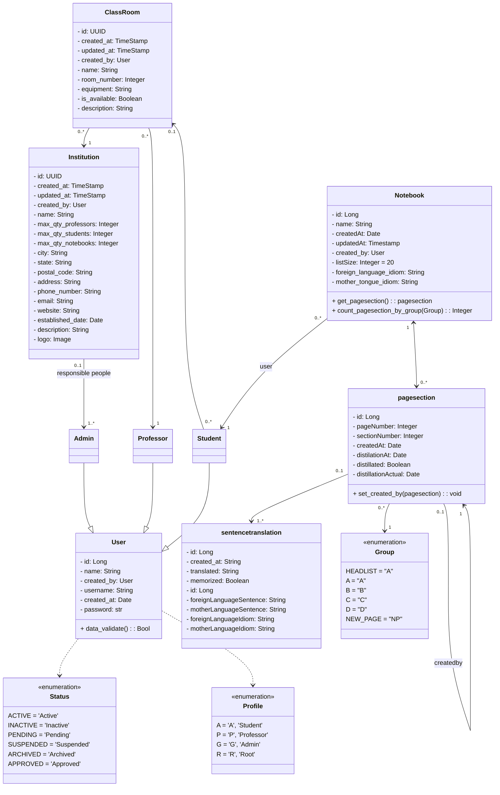

```mermaid
    classDiagram
        class User{
            - id: Long
            - name: String
            - created_by: User
            - username: String
            - created_at: Date
            - password: str
            
            + data_validate(): Bool
        }

        class Admin{

        }
        
        class Professor{

        }

        class Student{
            
        }

        class Institution {
            - id: UUID
            - created_at: TimeStamp
            - updated_at: TimeStamp
            - created_by: User
            - name: String
            - max_qty_professors: Integer
            - max_qty_students: Integer
            - max_qty_notebooks: Integer
            - city: String
            - state: String
            - postal_code: String
            - address: String
            - phone_number: String
            - email: String
            - website: String
            - established_date: Date
            - description: String
            - logo: Image
        }

        class ClassRoom {
            - id: UUID
            - created_at: TimeStamp
            - updated_at: TimeStamp
            - created_by: User
            - name: String
            - room_number: Integer
            - equipment: String
            - is_available: Boolean
            - description: String
        }

        class Notebook {
            - id: Long
            - name: String
            - createdAt: Date
            - updatedAt: Timestamp
            - created_by: User
            - listSize: Integer = 20
            - foreign_language_idiom: String
            - mother_tongue_idiom: String

            + get_pagesection(): pagesection
            + count_pagesection_by_group(Group): Integer 
        }        

        class pagesection {
            - id: Long
            - pageNumber: Integer
            - sectionNumber: Integer
            - createdAt: Date
            - distilationAt: Date
            - distillated: Boolean
            - distillationActual: Date

            + set_created_by(pagesection): void
        }

        class sentencetranslation {
            - id: Long
            - created_at: String
            - translated: String
            - memorized: Boolean
        }
        
        class sentencetranslation {
            - id: Long
            - foreignLanguageSentence: String
            - motherLanguageSentence: String
            - foreignLanguageIdiom: String      
            - motherLanguageIdiom: String   
        }

        class Group {
            <<enumeration>>
            HEADLIST = "A"
            A        = "A"
            B        = "B"
            C        = "C"
            D        = "D"
            NEW_PAGE = "NP"
        }
        
        class Status {
            <<enumeration>>
            ACTIVE    = 'Active'
            INACTIVE  = 'Inactive'
            PENDING   = 'Pending'
            SUSPENDED = 'Suspended'
            ARCHIVED  = 'Archived'
            APPROVED  = 'Approved'
        }
        
        class Profile {
            <<enumeration>>
            A = 'A', 'Student'
            P = 'P', 'Professor'
            G = 'G', 'Admin'
            R = 'R', 'Root'
        }
    

        User ..> Status
        User ..> Profile
        Admin --|> User
        Professor --|> User
        Student --|> User
        ClassRoom "0..1"     <--    "0..*" Student
        Notebook "0..*"      -->    "1" Student: user
        ClassRoom "0..*"     -->    "1" Professor
        ClassRoom "0..*"     -->    "1" Institution
        Notebook "1"         <-->    "0..*" pagesection
        
        Institution "0..1"   -->    "1..*" Admin: responsible people
        pagesection "0..*"   -->    "1" Group
        pagesection "0..1"   -->    "1..*" sentencetranslation
        pagesection "0..1"   -->    "1"   pagesection : createdby        
```
